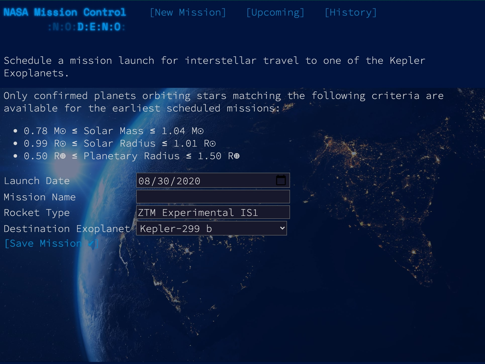
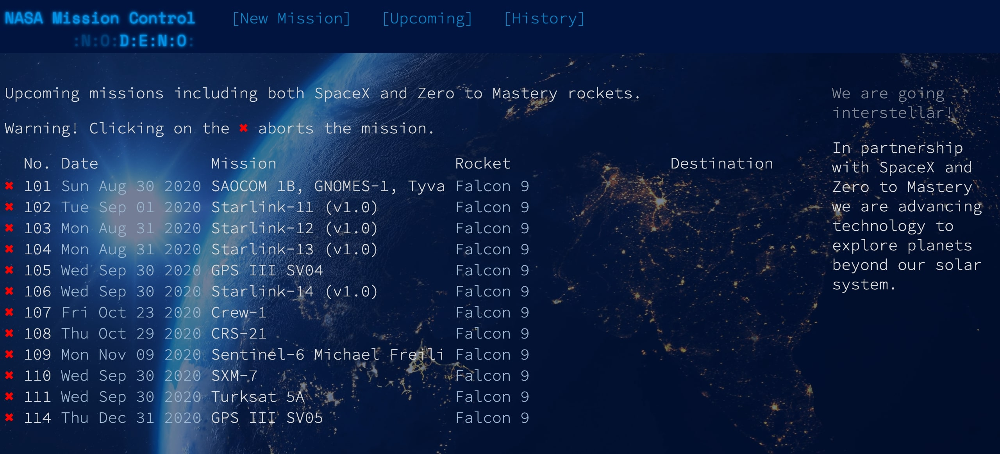
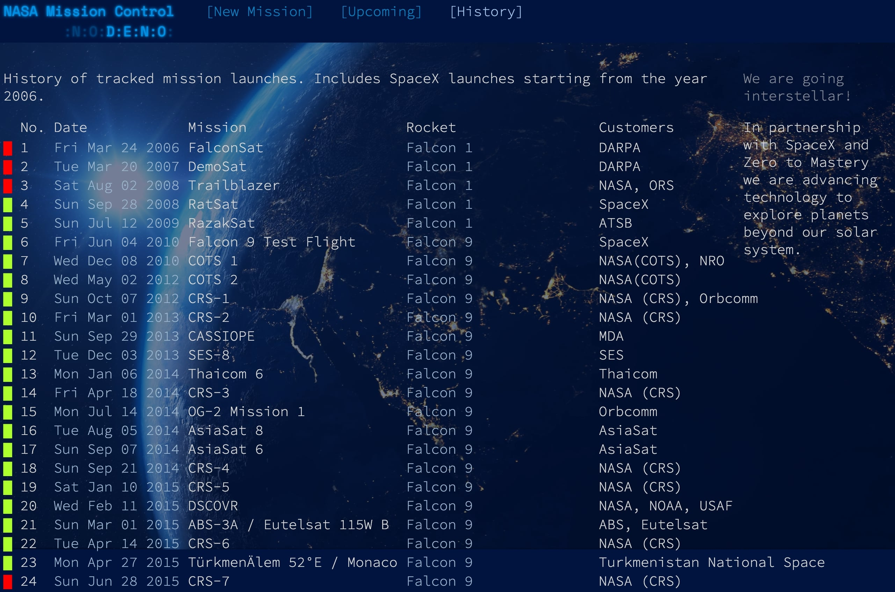

## NASA Mission Control Deno Project
## Overview

This project is a mock of a NASA Mission Control panel. From the homepage, a NASA rocket launch can be scheduled. The user also has the ability to see upcoming and historical launches.

The focus of this project was learning how to use Deno and understand how it differs from Node. This project utilizes TypeScript on the frontend, Deno on the backend and is deployed using Docker and AWS EC2. A custom API endpoint is used to access the launch data. This application is taken from Deno: The Complete Guide Zero to Mastery course from Andrei Neagoie.

## Project Screenshots

Homepage screenshot where a rocket launch can be scheduled.

A view of upcoming rocket launches

A view of historic launch data

## View The Project

To see this repository, please visit this webpage (http://ec2-3-81-118-56.compute-1.amazonaws.com:8000/index.html)

## Reflection

This project was an introduction to Deno on the backend and TypeScript on the frontend.

The main lesson taken from this project is understanding how to build production ready applications that are secure, performant and can be easily scaled through AWS. 